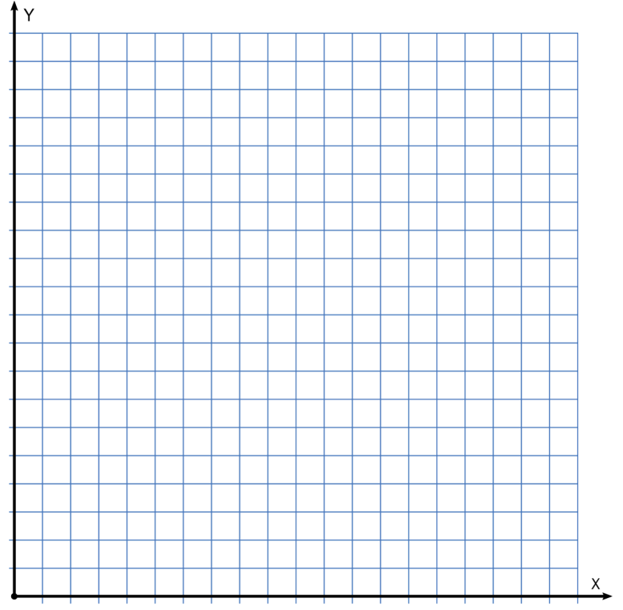

# Aufgabe 1: Ein Gas schreibt Klimageschichte - Treibhausklima in der Flasche


::: question-box
**Teamname:**
:::

# CO₂ und Lufttemperatur

::: {.callout-tip appearance="minimal"}
Der Klimawandel wird als von Menschen gemacht beschrieben. Das liegt daran, dass wir Gase ausstoßen, zum Beispiel CO₂ beim Autofahren. Diese Gase verstärken den Treibhauseffekt. Sie wirken wie eine Decke:

-   Sie lassen die Sonnenstrahlen hinein
-   Aber sie halten einen Teil der Wärme fest

Das bedeutet: Wenn mehr CO₂ in der Luft ist, wird es wärmer.

**Das untersucht ihr jetzt selbst.**
:::

# Forschungsfrage

::: question-box
**Macht mehr CO₂ in der Luft die Luft bei Erwärmung wärmer?**
:::

# Vermutungen

::: hypothesis-box
**Vermutung 1:** Mehr CO₂ sorgt bei Wärme für eine höhere Temperatur der Luft.

**Vermutung 0:** Mehr CO₂ sorgt bei Wärme **nicht** für eine höhere Temperatur der Luft.
:::

Am Ende entscheidet ihr, welche Vermutung besser zu euren Messwerten passt.

## Aufgabe A – Experiment planen

### 1. Aufbau planen

Wie müssen die beiden Flaschen vorbereitet werden, damit man sie vergleichen kann?

::: answer-box
Versuchsaufbau-Zeichnung/Beschreibung
:::


### 2. Durchführung planen


Wer macht was? Wann wird gemessen? Wie lange läuft das Experiment? Erstellt eine geeignete Tabelle.

::: answer-box
Durchführungsplan und Tabelle
:::

::: {.callout-note appearance="minimal"}
**Das Experiment muss mindestens 15 Minuten lang durchgeführt werden**
:::

### Material

-   zwei gleich große, durchsichtige Flaschen
-   Thermometer
-   Knete zum Abdichten
-   Stoppuhr oder Timer (Tablet)
-   Wärmelampe
-   Essig und Backpulver, damit kann CO₂ hergestellt werden
-   Messprotokoll


```{=html}
<table class="messprotokoll">
  <thead>
    <tr>
      <th class="zeit"></th>
      <th><br><span></span></th>
      <th><br><span></span></th>
      <th></th>
    </tr>
  </thead>
  <tbody>
    <tr><td></td><td></td><td></td><td></td></tr>
    <tr><td></td><td></td><td></td><td></td></tr>
    <tr><td></td><td></td><td></td><td></td></tr>
    <tr><td></td><td></td><td></td><td></td></tr>
    <tr><td></td><td></td><td></td><td></td></tr>
    <tr><td></td><td></td><td></td><td></td></tr>
    <tr><td></td><td></td><td></td><td></td></tr>
    <tr><td></td><td></td><td></td><td></td></tr>
    <tr><td></td><td></td><td></td><td></td></tr>
    <tr><td></td><td></td><td></td><td></td></tr>
    <tr><td></td><td></td><td></td><td></td></tr>
    <tr><td></td><td></td><td></td><td></td></tr>
    <tr><td></td><td></td><td></td><td></td></tr>
    <tr><td></td><td></td><td></td><td></td></tr>
    <tr><td></td><td></td><td></td><td></td></tr>
    <tr><td></td><td></td><td></td><td></td></tr>
  </tbody>
</table>
```



## Aufgabe B – Experiment durchführen

- Stellt eure Ergebnisse übersichtlich dar (z. B. Tabelle oder Diagramm) 
- Beschreibt, was ihr beobachtet habt 
- Entscheidet: Welche Vermutung passt besser? 

**Streicht die falsche Vermutung durch und macht ein Häkchen bei der richtigen.**


# Zusatzfrage

::: {.callout-warning appearance="minimal"}
## Nachdenken über das Experiment

Kann man mit diesem Experiment direkt beweisen, dass die echte Erde wärmer wird?
:::

::: checkbox-block
☐ ja\
☐ nein\
☐ nicht sicher
:::


::: answer-box
**Begründung:**
:::

# Merksatz

Ergänzt den Satz mit euren Ergebnissen.

::: answer-box.medium
In unserem Experiment hat die Flasche mit \_\_\_\_\_\_\_\_\_\_\_\_\_\_\_\_\_\_\_\_\_\_\_\_\_\_ sich \_\_\_\_\_\_\_\_\_\_\_\_\_\_\_\_\_\_\_\_\_\_\_\_\_\_ erwärmt als die andere Flasche. Deshalb passt Vermutung \_\_\_\_\_\_ besser zu unseren Messwerten.
:::
