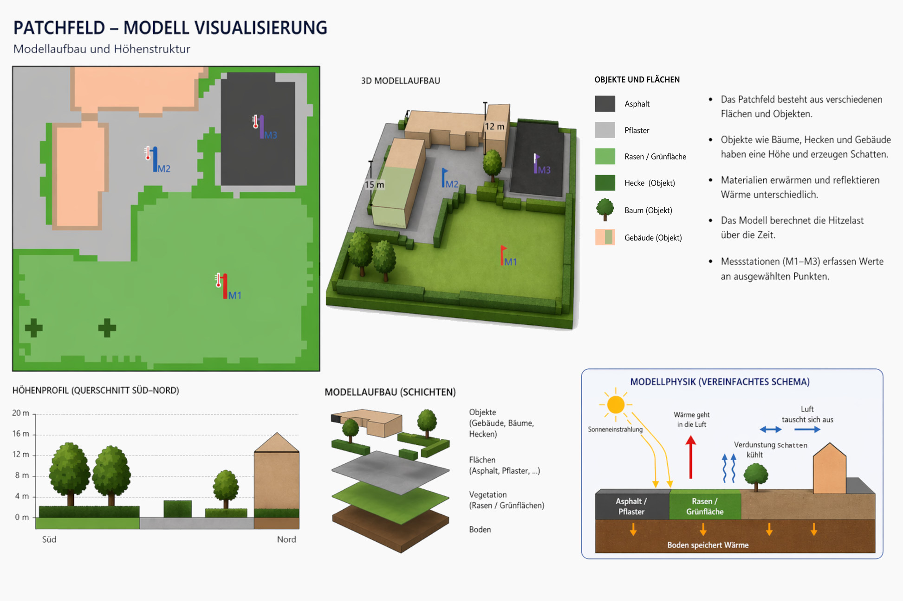
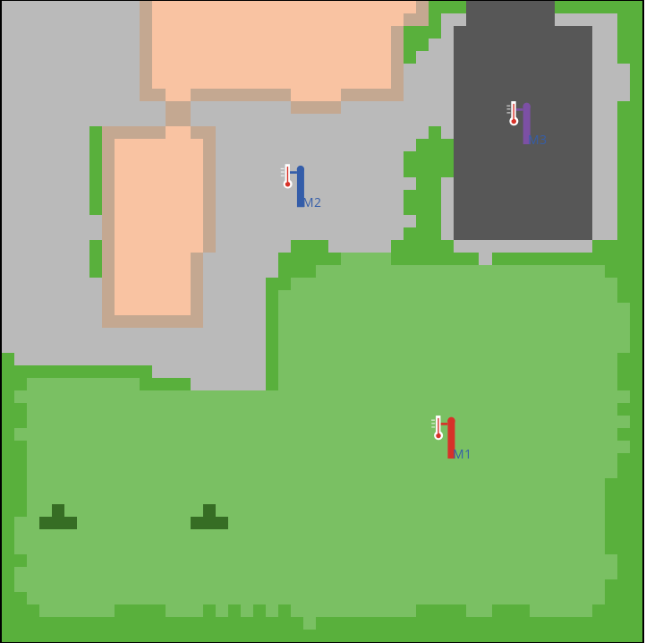

# Die Modellsimulation – den Schulhof optimieren

::: question-box
**Teamname:** 
:::

::: {.callout-tip appearance="minimal"}
Durch den Klimawandel wird es öfter sehr heiß. Das merken wir auch auf Schulhöfen.

Damit man nicht einfach irgendetwas verändert, kann man zuerst am Computer ausprobieren, was gut hilft. So ein Ausprobieren mit einem Modell nennt man Simulation.

Ihr arbeitet jetzt mit so einer Simulation. Damit untersucht ihr, wo sich der Schulhof besonders stark aufheizt und was man dagegen tun kann.

**Das Ziel ist: herauszufinden, wie der Aufenthalt auf dem Schulhof bei Hitze besser wird.**

:::




# Arbeitsauftrag: Hitzebelastung auf dem Schulhof untersuchen

## Fragestellung

::: question-box

- Wo ist es auf dem Schulhof während der Schulzeit besonders belastend heiß und woran könnte das liegen?
- Wo sind Maßnahmen zur Abkühlung wirklich nötig und welche Maßnahmen sind dort realistisch umsetzbar?

:::

## Aufgabe 1: Wo ist es heiß?

Untersucht den Schulhof mit dem Modell.

Überlegt euch: 

- Wo halten sich die Schüler*innen auf?
- Wann sind die Schüler*innen auf dem Schulhof

Findet heraus:

- An welchen Orten ist die Hitzebelastung besonders hoch?
- An welchen Orten ist sie schon relativ gering?

**Zeichnet eine Problemzone in die Karte ein, die ihr verbessern wollt:**




**Begründet eure Wahl kurz:**

::: answer-box
**Antwort:**
:::

## Aufgabe 2: Wie wird es kühler?

Probiert nun eure Problemzone zu verbessern.

Diese Maßnahmen (und noch mehr) könnt ihr im Modell ausprobieren:

- Dachbegrünung
- Fassadenbegrünung
- Entsiegelung des Asphalt-Parkplatzes
- Bäume, Hecken oder Rasen anlegen

**Überlegt euch, wie ihr die Wirkung der Maßnahmen vergleichen könnt!**

::: answer-box
**Antwort:**
:::

## Aufgabe 3: Was planen wir?

Wählt am Ende zwei Maßnahmen aus, die ihr für den Schulhof am sinnvollsten haltet.

**Unsere zwei Maßnahmen sind:**

::: answer-box-medium
**1.**
:::

::: answer-box-medium
**2.**
:::


::: answer-box
**Darum sind sie sinnvoller als andere Maßnahmen:**
:::


::: answer-box
**Darum sind sie auch realistisch umsetzbar:**
:::

# Material

## So arbeitet ihr mit dem Modell

1. Ausgangszustand verstehen
2. Problemstellen analysieren
3. Maßnahme testen
4. Vergleich durchführen

## Wie geht das?

Mit dem Modell untersucht ihr den Schulhof bei Hitze. Ihr schaut zuerst, wo die Belastung hoch ist. Danach probiert ihr Maßnahmen aus und vergleicht, ob sich die Situation verbessert.

Startet zuerst das Modell mit `Modellstart / -reset`,  und dann den Ist-Zustand-Versuch mit `Versuch starten`. 

Schaut euch danach vor allem die Karten *Hitzelast aktuell* und *Hitzelast Schulzeit* an. Sucht Bereiche, die besonders stark belastet sind. Achtet darauf, was dort auffällt: Materialbeschaffenheit, viel/wenig Schatten/Sonne, Gebäude oder viel/wenig Pflanzen, unterschiedliche Pflanzen.

Überlegt euch auf der Grundlage dieser Beobachtungen Maßnahmen die ihr für sinnvoll haltet und gestaltet sie mit `Karte bearbeiten``` (etwa: *Baum, Hecke, Rasen, Sportflächen Offenpflaster*).

Drückt danach `Maßnahme aktivieren`.  **Wichtig:** Jetzt _**nicht**_ `Modellstart / -reset` drücken weil sonst der gespeicherte Ist-Zustand-Versuch als Vergleichsgrundlage gelöscht wird, sondern wieder  `Versuch starten``` auswählen.

Unter Kartenansicht findet ihr nun die Karte *Hitzelast Änderung* die euch zeigt was sich wo verändert hat. 

Wenn ihr eine bestimmte Fläche  prüfen wollt, wählt unter  `Karte bearbeiten` *Gebiet-auswählen*, markiert die Fläche mit der Maus und drückt `Auswahlgebiet vergleichen`. Dann könnt ihr Monitorfeldern die genauen Ergebnisse sehen.

